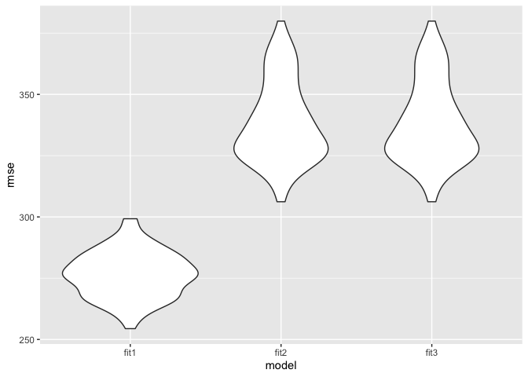
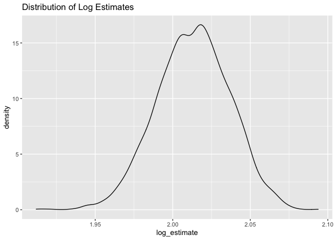

p8105\_hw6\_ajp2257
================
Amy Pitts
11/23/2020

# Question 1

##### The Washington Post has gathered data on homicides in 50 large U.S. cities and made the data available through a GitHub repository here. You can read their accompanying article here.

##### Create a city\_state variable (e.g. “Baltimore, MD”), and a binary variable indicating whether the homicide is solved. Omit cities Dallas, TX; Phoenix, AZ; and Kansas City, MO – these don’t report victim race. Also omit Tulsa, AL – this is a data entry mistake. For this problem, limit your analysis those for whom victim\_race is white or black. Be sure that victim\_age is numeric.

``` r
homicide_df = read_csv("data/homicide-data.csv", na = c("", "NA", "Unknown")) %>% #
  mutate( 
    city_state = str_c(city, state, sep = "_"),
    victim_age = as.numeric(victim_age),
    resolution = case_when( # new variable that depends on disposition 
      disposition == "Closed without arrest" ~ "unsolved",
      disposition == "Open/No arrest"        ~ "unsolved",
      disposition == "Closed by arrest"      ~ "solved",
    )
  ) %>%
  filter(
    victim_race %in% c("White", "Black"),
    city_state != "Tulsa_AL") %>%
  dplyr::select(city_state, resolution, victim_age, victim_race, victim_sex)
```

##### For the city of Baltimore, MD, use the glm function to fit a logistic regression with resolved vs unresolved as the outcome and victim age, sex and race as predictors. Save the output of glm as an R object; apply the broom::tidy to this object; and obtain the estimate and confidence interval of the adjusted odds ratio for solving homicides comparing non-white victims to white victims keeping all other variables fixed.

``` r
baltimore_df = 
  homicide_df %>%
  filter(city_state == "Baltimore_MD")

glm(factor(resolution) ~ victim_age + victim_race + victim_sex,
    data = baltimore_df,
    family = binomial()) %>%
  broom::tidy() %>%
  mutate(
    OR = exp(estimate),
    CI_lower = exp(estimate - 1.96 * std.error),
    CI_upper = exp(estimate + 1.96 * std.error)
  ) %>%
  dplyr::select(term, OR, starts_with("CI") ) %>%
  knitr::kable(digits = 3)
```

| term              |    OR | CI\_lower | CI\_upper |
| :---------------- | ----: | --------: | --------: |
| (Intercept)       | 0.733 |     0.524 |     1.026 |
| victim\_age       | 1.007 |     1.000 |     1.013 |
| victim\_raceWhite | 0.431 |     0.306 |     0.607 |
| victim\_sexMale   | 2.350 |     1.793 |     3.081 |

##### Now run glm for each of the cities in your dataset, and extract the adjusted odds ratio (and CI) for solving homicides comparing Black victims to white victims. Do this within a “tidy” pipeline, making use of purrr::map, list columns, and unnest as necessary to create a dataframe with estimated ORs and CIs for each city.

``` r
model_results = 
homicide_df %>%
  nest(data = -city_state) %>%
  mutate(
    models = map(.x = data, ~glm(factor(resolution) ~ victim_age + victim_race + victim_sex,
                                    data = .x, family = binomial())),
    results = map(models, broom::tidy)
  ) %>%
  dplyr::select(city_state, results) %>%
  unnest(results) %>%
  mutate(
    OR = exp(estimate),
    CI_lower = exp(estimate - 1.96 * std.error),
    CI_upper = exp(estimate + 1.96 * std.error)
  ) %>%
  select(city_state, term, OR, starts_with("CI") )
```

##### Create a plot that shows the estimated ORs and CIs for each city. Organize cities according to estimated OR, and comment on the plot.

``` r
model_results %>%
  filter(term == "victim_sexMale") %>%
  mutate(
    city_state  = fct_reorder(city_state, OR)
  ) %>%
  ggplot(aes(x = city_state, y = OR)) +
  geom_point() +
  geom_errorbar(aes(ymin = CI_lower, ymax = CI_upper)) +
  theme(axis.text.x = element_text(angle = 90, vjust = 0.5, hjust = 1) ) +
  labs(
    title = "Comparing Homicide Rates (Male and Females Victims)"
  )
```

<!-- -->

# Question 2

##### In this problem, you will analyze data gathered to understand the effects of several variables on a child’s birthweight. This dataset, available here, consists of roughly 4000 children and includes the following variables:

  - `babysex`: baby’s sex (male = 1, female = 2)
  - `bhead`: baby’s head circumference at birth (centimeters)
  - `blength`: baby’s length at birth (centimeters)
  - `bwt`: baby’s birth weight (grams)
  - `delwt`: mother’s weight at delivery (pounds)
  - `fincome`: family monthly income (in hundreds, rounded)
  - `frace`: father’s race (1 = White, 2 = Black, 3 = Asian, 4 = Puerto
    Rican, 8 = Other, 9 = Unknown)
  - `gaweeks`: gestational age in weeks
  - `malform`: presence of malformations that could affect weight (0 =
    absent, 1 = present)
  - `menarche`: mother’s age at menarche (years)
  - `mheigth`: mother’s height (inches)
  - `momage`: mother’s age at delivery (years)
  - `mrace`: mother’s race (1 = White, 2 = Black, 3 = Asian, 4 = Puerto
    Rican, 8 = Other)
  - `parity`: number of live births prior to this pregnancy
  - `pnumlbw`: previous number of low birth weight babies
  - `pnumgsa`: number of prior small for gestational age babies
  - `ppbmi`: mother’s pre-pregnancy BMI
  - `ppwt`: mother’s pre-pregnancy weight (pounds)
  - `smoken`: average number of cigarettes smoked per day during
    pregnancy
  - `wtgain`: mother’s weight gain during pregnancy (pounds)

##### Load and clean the data for regression analysis (i.e. convert numeric to factor where appropriate, check for missing data, etc.).

``` r
birthweight_df = read_csv("data/birthweight.csv") %>% # load the data 
  janitor::clean_names() %>% # clean the names 
  mutate( # need to make sure some of the variables are factor instead of double 
    babysex = factor(babysex),
    frace = factor(frace),
    malform = factor(malform),
    mrace = factor(mrace)
  )
head(birthweight_df)
```

    ## # A tibble: 6 x 20
    ##   babysex bhead blength   bwt delwt fincome frace gaweeks malform menarche
    ##   <fct>   <dbl>   <dbl> <dbl> <dbl>   <dbl> <fct>   <dbl> <fct>      <dbl>
    ## 1 2          34      51  3629   177      35 1        39.9 0             13
    ## 2 1          34      48  3062   156      65 2        25.9 0             14
    ## 3 2          36      50  3345   148      85 1        39.9 0             12
    ## 4 1          34      52  3062   157      55 1        40   0             14
    ## 5 2          34      52  3374   156       5 1        41.6 0             13
    ## 6 1          33      52  3374   129      55 1        40.7 0             12
    ## # … with 10 more variables: mheight <dbl>, momage <dbl>, mrace <fct>,
    ## #   parity <dbl>, pnumlbw <dbl>, pnumsga <dbl>, ppbmi <dbl>, ppwt <dbl>,
    ## #   smoken <dbl>, wtgain <dbl>

``` r
# checking if there are missing values
sum(is.na(birthweight_df) ) # there are no missing values in this dataset! 
```

    ## [1] 0

##### Propose a regression model for birthweight. This model may be based on a hypothesized structure for the factors that underly birthweight, on a data-driven model-building process, or a combination of the two. Describe your modeling process and show a plot of model residuals against fitted values – use add\_predictions and add\_residuals in making this plot.

``` r
# using a stepwise selection to try to determine what variables to use 
fit = lm(bwt ~., data = birthweight_df)
# stepAIC comes from the MASS pacakge 
step = MASS::stepAIC(fit, direction="both") # I am going to use both directions 
# I am not printing out all the steps just the final results 
```

``` r
step$anova # display results from the stepwise 
```

    ## Stepwise Model Path 
    ## Analysis of Deviance Table
    ## 
    ## Initial Model:
    ## bwt ~ babysex + bhead + blength + delwt + fincome + frace + gaweeks + 
    ##     malform + menarche + mheight + momage + mrace + parity + 
    ##     pnumlbw + pnumsga + ppbmi + ppwt + smoken + wtgain
    ## 
    ## Final Model:
    ## bwt ~ babysex + bhead + blength + delwt + fincome + gaweeks + 
    ##     mheight + mrace + parity + ppwt + smoken
    ## 
    ## 
    ##         Step Df   Deviance Resid. Df Resid. Dev      AIC
    ## 1                               4320  320724338 48717.83
    ## 2   - wtgain  0      0.000      4320  320724338 48717.83
    ## 3  - pnumsga  0      0.000      4320  320724338 48717.83
    ## 4  - pnumlbw  0      0.000      4320  320724338 48717.83
    ## 5    - frace  4 124365.432      4324  320848704 48711.51
    ## 6  - malform  1   1447.241      4325  320850151 48709.53
    ## 7    - ppbmi  1   6928.376      4326  320857079 48707.63
    ## 8   - momage  1  29211.120      4327  320886290 48706.02
    ## 9 - menarche  1 100121.331      4328  320986412 48705.38

``` r
# The results give me an optimal model of 
# bwt ~ babysex + bhead + blength + delwt + fincome + gaweeks + mheight + mrace + parity + ppwt + smoken
```

``` r
# this model is given by the step wise comparision 
fit1 = lm(bwt ~ babysex + bhead + blength + delwt + 
                fincome + gaweeks + mheight + mrace + 
                parity + ppwt + smoken,
          data= birthweight_df)

# This gives info about the quality of the model 
fit1 %>%
  broom::glance()
```

    ## # A tibble: 1 x 12
    ##   r.squared adj.r.squared sigma statistic p.value    df  logLik    AIC    BIC
    ##       <dbl>         <dbl> <dbl>     <dbl>   <dbl> <dbl>   <dbl>  <dbl>  <dbl>
    ## 1     0.718         0.717  272.      848.       0    13 -30500. 61029. 61125.
    ## # … with 3 more variables: deviance <dbl>, df.residual <int>, nobs <int>

``` r
# looking at the estimates and the p-values
fit1 %>%
  broom::tidy()
```

    ## # A tibble: 14 x 5
    ##    term         estimate std.error statistic   p.value
    ##    <chr>           <dbl>     <dbl>     <dbl>     <dbl>
    ##  1 (Intercept) -6099.      138.       -44.3  0.       
    ##  2 babysex2       28.6       8.45       3.38 7.37e-  4
    ##  3 bhead         131.        3.45      37.9  3.10e-272
    ##  4 blength        74.9       2.02      37.1  4.29e-262
    ##  5 delwt           4.11      0.392     10.5  2.26e- 25
    ##  6 fincome         0.318     0.175      1.82 6.88e-  2
    ##  7 gaweeks        11.6       1.46       7.93 2.79e- 15
    ##  8 mheight         6.59      1.78       3.69 2.23e-  4
    ##  9 mrace2       -139.        9.91     -14.0  1.21e- 43
    ## 10 mrace3        -74.9      42.3       -1.77 7.68e-  2
    ## 11 mrace4       -101.       19.3       -5.21 1.98e-  7
    ## 12 parity         96.3      40.3        2.39 1.70e-  2
    ## 13 ppwt           -2.68      0.427     -6.26 4.20e- 10
    ## 14 smoken         -4.84      0.586     -8.27 1.75e- 16

``` r
# this is the histogram of just the residuals  
birthweight_df %>%
  modelr::add_residuals(fit1) %>%
  ggplot(aes(x = resid)) +
  geom_density()
```

<!-- -->

``` r
# plot of model residuals against fitted values
birthweight_df %>% 
  modelr::add_residuals(fit1) %>% 
  modelr::add_predictions(fit1) %>%
  ggplot(aes(x = pred, y = resid)) + 
  geom_point() +
  labs(
    title = "Model 1 Residuals against fitted value",
    subtitle = "Using predictors given by the stepwise function ",
    x = "Fitted Value",
    y = "Residuals"
  )
```

<!-- -->

##### Compare your model to two others:

  - One using length at birth and gestational age as predictors (main
    effects only)
  - One using head circumference, length, sex, and all interactions
    (including the three-way interaction) between these Make this
    comparison in terms of the cross-validated prediction error; use
    crossv\_mc and functions in purrr as appropriate.

Setting up the two new models described above.

``` r
fit2 = lm(bwt ~ blength + gaweeks,  data = birthweight_df)
fit3 = lm(bwt ~ blength + bhead  + babysex + 
                bhead*blength + bhead*babysex + blength*babysex + 
                bhead*blength*babysex, 
          data = birthweight_df)
```

Comparing all the models with a quick visualization

``` r
birthweight_df %>% 
  gather_predictions(fit1, fit2, fit3) %>% 
  mutate(model = fct_inorder(model)) %>% 
  ggplot(aes(x = blength, y = bwt)) + 
  geom_point(alpha = .5) +
  geom_line(aes(y = pred), color = "red") + 
  facet_grid(~model)
```

<!-- -->
The red line represents the regression line and the points represent the
values.

Cross validation to compare all the models

``` r
# creating testing and training model 
cv_df =
  crossv_mc(birthweight_df, 100) %>% 
  mutate(
    train = map(train, as_tibble),
    test = map(test, as_tibble))

# updating the dataset to now include each regression model and the rmse 
cv_df = 
  cv_df %>% 
  mutate(
    fit1  = map(train, ~lm(bwt ~ babysex + bhead + blength + delwt + 
                                 fincome + gaweeks + mheight + mrace + 
                                 parity + ppwt + smoken, 
                           data = .x)),
    fit2  = map(train, ~lm(bwt ~ blength + gaweeks, data = .x)),
    fit3  = map(train, ~lm(bwt ~ blength + bhead  + babysex + 
                bhead*blength + bhead*babysex + blength*babysex + 
                bhead*blength*babysex, data = .x))
  ) %>% 
  mutate(
    rmse_fit1 = map2_dbl(fit1, test, ~rmse(model = .x, data = .y)),
    rmse_fit2 = map2_dbl(fit2, test, ~rmse(model = .x, data = .y)),
    rmse_fit3 = map2_dbl(fit2, test, ~rmse(model = .x, data = .y))
  )

# plotting the rmse of the three models 
cv_df %>%
  dplyr::select(starts_with("rmse")) %>%
  pivot_longer(
    everything(),
    names_to = "model",
    values_to = "rmse",
    names_prefix = "rmse_") %>%
  mutate(model = fct_inorder(model)) %>%
  ggplot(aes(x = model, y = rmse)) + geom_violin()
```

<!-- -->

This violin plot shows that the lowest rmse value come from the fit1
which is the only I create. I choose the predictors based on a stepwise
selection so it makes sense that is preforming the best compare to the
other two. Comparing fit2 against fit3 we don’t see a huge difference so
if I had to choose one or the other I would choose the simpler model
without all the interaction terms. However, fit1 does have the lowest
rmse values and has no over complicating interaction terms therefore I
would select this model.

# Question 3

##### For this problem, we’ll use the 2017 Central Park weather data that we’ve seen elsewhere. The code chunk below (adapted from the course website) will download these data.

``` r
weather_df = 
  rnoaa::meteo_pull_monitors(
    c("USW00094728"),
    var = c("PRCP", "TMIN", "TMAX"), 
    date_min = "2017-01-01",
    date_max = "2017-12-31") %>%
  mutate(
    name = recode(id, USW00094728 = "CentralPark_NY"),
    tmin = tmin / 10,
    tmax = tmax / 10) %>%
  select(name, id, everything())
```

##### The boostrap is helpful when you’d like to perform inference for a parameter / value / summary that doesn’t have an easy-to-write-down distribution in the usual repeated sampling framework. We’ll focus on a simple linear regression with tmax as the response and tmin as the predictor, and are interested in the distribution of two quantities estimated from these data:

  - r^2
  - log(hatβ0∗hatβ1)

##### Use 5000 bootstrap samples and, for each bootstrap sample, produce estimates of these two quantities. Plot the distribution of your estimates, and describe these in words. Using the 5000 bootstrap estimates, identify the 2.5% and 97.5% quantiles to provide a 95% confidence interval for r̂2 and log(β̂0∗β̂1). Note: broom::glance() is helpful for extracting r̂2 from a fitted regression, and broom::tidy() (with some additional wrangling) should help in computing d log(β̂0∗β̂1).

``` r
# getting the two measurements 
two_quantities = weather_df %>% 
  modelr::bootstrap(n = 5000) %>%  # running 5000 bootstop 
  mutate(
    models = map(strap, ~ lm(tmax ~ tmin ,  data = .x)), # the model with tmax and tmin
    rsquare = map(models, broom::glance),  # getting r square results from glance 
    results = map(models, broom::tidy)) %>% # getting estimates from tidy 
  select(rsquare, results) %>% # select only the rsquare and the results 
  unnest(results) %>% # now be unnesting the results we are going to get the log estimate. 
  select(estimate, rsquare) %>%
  mutate(
    names = rep(c("beta0", "beta1"), 5000)  # adding the names of estimates so we can pivot wider 
  ) %>% 
  relocate(names) %>% 
  pivot_wider( # pivoting wider so that the estiamtes are seperated
    names_from = names,
    values_from = estimate
  ) %>%
  mutate(
    log_estimate = log(beta0*beta1) # this is the log estimates 
  ) %>%
  unnest(rsquare) %>% # unnest the model characteristic 
  select(r.squared, log_estimate)  # only want the r.square and the log_estimates
```

``` r
# plotting the log_estimates 
two_quantities %>%
  ggplot(aes(x = log_estimate)) + 
  geom_density() +
  labs(
    title = "Distribution of Log Estimates"
  )
```

<!-- -->

The log(beta0\*beta1) has a mean values above 2 but below 2.025. The
rest of the values are normally distributed around the mean. The range
of the intervals does not seem larger below 2.10 and above 1.85.

``` r
# plotting the r squared valeus 
two_quantities %>%
  ggplot(aes(x = r.squared)) + 
  geom_density() +
  labs(
    title = "Distribution of R Squared Values"
  )
```

<!-- -->

The distribution of r squared values also looks normally distributed
with mean between 0.90 and 0.92. The range of values in this
distribution also seems contained to about 0.86 to 0.94.

``` r
# getting the mean and the CI intervals 
interval = two_quantities %>%
  summarize(
    mean_rsquared = mean(r.squared),
    lower_CI = quantile(r.squared)[2],
    upper_CI = quantile(r.squared)[4],
    mean_log_estimate = mean(log_estimate),
    lower_CI_log = quantile(log_estimate)[2],
    upper_CI_log = quantile(log_estimate)[4],
  )

# printing out the interval 
interval
```

    ## # A tibble: 1 x 6
    ##   mean_rsquared lower_CI upper_CI mean_log_estimate lower_CI_log upper_CI_log
    ##           <dbl>    <dbl>    <dbl>             <dbl>        <dbl>        <dbl>
    ## 1         0.911    0.906    0.917              2.01         2.00         2.03

The mean value of the r squared values from the bootstrap is 0.9113945
and has a 95% confidence interval of (0.9059235, 0.9171315). The mean
value of the log(beta0\*beta1) is 2.0134851 with a 95% confidence
interval of (1.9979109, 2.0295375).
