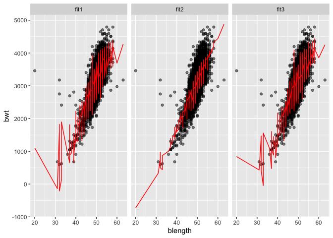

p8105\_hw6\_ajp2257
================
Amy Pitts
11/23/2020

# Question 1

##### The Washington Post has gathered data on homicides in 50 large U.S. cities and made the data available through a GitHub repository here. You can read their accompanying article here.

##### Create a city\_state variable (e.g. “Baltimore, MD”), and a binary variable indicating whether the homicide is solved. Omit cities Dallas, TX; Phoenix, AZ; and Kansas City, MO – these don’t report victim race. Also omit Tulsa, AL – this is a data entry mistake. For this problem, limit your analysis those for whom victim\_race is white or black. Be sure that victim\_age is numeric.

``` r
homicide_df = read_csv("data/homicide-data.csv", na = c("", "NA", "Unknown")) %>% #
  mutate( 
    city_state = str_c(city, state, sep = "_"),
    victim_age = as.numeric(victim_age),
    resolution = case_when( # new variable that depends on disposition 
      disposition == "Closed without arrest" ~ "unsolved",
      disposition == "Open/No arrest"        ~ "unsolved",
      disposition == "Closed by arrest"      ~ "solved",
    )
  ) %>%
  filter(
    victim_race %in% c("White", "Black"),
    city_state != "Tulsa_AL") %>%
  dplyr::select(city_state, resolution, victim_age, victim_race, victim_sex)
```

##### For the city of Baltimore, MD, use the glm function to fit a logistic regression with resolved vs unresolved as the outcome and victim age, sex and race as predictors. Save the output of glm as an R object; apply the broom::tidy to this object; and obtain the estimate and confidence interval of the adjusted odds ratio for solving homicides comparing non-white victims to white victims keeping all other variables fixed.

``` r
baltimore_df = 
  homicide_df %>%
  filter(city_state == "Baltimore_MD")

glm(factor(resolution) ~ victim_age + victim_race + victim_sex,
    data = baltimore_df,
    family = binomial()) %>%
  broom::tidy() %>%
  mutate(
    OR = exp(estimate),
    CI_lower = exp(estimate - 1.96 * std.error),
    CI_upper = exp(estimate + 1.96 * std.error)
  ) %>%
  dplyr::select(term, OR, starts_with("CI") ) %>%
  knitr::kable(digits = 3)
```

| term              |    OR | CI\_lower | CI\_upper |
| :---------------- | ----: | --------: | --------: |
| (Intercept)       | 0.733 |     0.524 |     1.026 |
| victim\_age       | 1.007 |     1.000 |     1.013 |
| victim\_raceWhite | 0.431 |     0.306 |     0.607 |
| victim\_sexMale   | 2.350 |     1.793 |     3.081 |

##### Now run glm for each of the cities in your dataset, and extract the adjusted odds ratio (and CI) for solving homicides comparing Black victims to white victims. Do this within a “tidy” pipeline, making use of purrr::map, list columns, and unnest as necessary to create a dataframe with estimated ORs and CIs for each city.

``` r
model_results = 
homicide_df %>%
  nest(data = -city_state) %>%
  mutate(
    models = map(.x = data, ~glm(factor(resolution) ~ victim_age + victim_race + victim_sex,
                                    data = .x, family = binomial())),
    results = map(models, broom::tidy)
  ) %>%
  dplyr::select(city_state, results) %>%
  unnest(results) %>%
  mutate(
    OR = exp(estimate),
    CI_lower = exp(estimate - 1.96 * std.error),
    CI_upper = exp(estimate + 1.96 * std.error)
  ) %>%
  dplyr::select(city_state, term, OR, starts_with("CI") )
```

##### Create a plot that shows the estimated ORs and CIs for each city. Organize cities according to estimated OR, and comment on the plot.

``` r
model_results %>%
  filter(term == "victim_sexMale") %>%
  mutate(
    city_state  = fct_reorder(city_state, OR)
  ) %>%
  ggplot(aes(x = city_state, y = OR)) +
  geom_point() +
  geom_errorbar(aes(ymin = CI_lower, ymax = CI_upper)) +
  theme(axis.text.x = element_text(angle = 90, vjust = 0.5, hjust = 1) ) +
  labs(
    title = "Comparing Homicide Rates (Male and Females Victims)"
  )
```

<!-- -->

# Question 2

##### In this problem, you will analyze data gathered to understand the effects of several variables on a child’s birthweight. This dataset, available here, consists of roughly 4000 children and includes the following variables:

  - `babysex`: baby’s sex (male = 1, female = 2)
  - `bhead`: baby’s head circumference at birth (centimeters)
  - `blength`: baby’s length at birth (centimeters)
  - `bwt`: baby’s birth weight (grams)
  - `delwt`: mother’s weight at delivery (pounds)
  - `fincome`: family monthly income (in hundreds, rounded)
  - `frace`: father’s race (1 = White, 2 = Black, 3 = Asian, 4 = Puerto
    Rican, 8 = Other, 9 = Unknown)
  - `gaweeks`: gestational age in weeks
  - `malform`: presence of malformations that could affect weight (0 =
    absent, 1 = present)
  - `menarche`: mother’s age at menarche (years)
  - `mheigth`: mother’s height (inches)
  - `momage`: mother’s age at delivery (years)
  - `mrace`: mother’s race (1 = White, 2 = Black, 3 = Asian, 4 = Puerto
    Rican, 8 = Other)
  - `parity`: number of live births prior to this pregnancy
  - `pnumlbw`: previous number of low birth weight babies
  - `pnumgsa`: number of prior small for gestational age babies
  - `ppbmi`: mother’s pre-pregnancy BMI
  - `ppwt`: mother’s pre-pregnancy weight (pounds)
  - `smoken`: average number of cigarettes smoked per day during
    pregnancy
  - `wtgain`: mother’s weight gain during pregnancy (pounds)

##### Load and clean the data for regression analysis (i.e. convert numeric to factor where appropriate, check for missing data, etc.).

``` r
birthweight_df = read_csv("data/birthweight.csv") %>% # load the data 
  janitor::clean_names() %>% # clean the names 
  mutate( # need to make sure some of the variables are factor instead of double 
    babysex = factor(babysex),
    frace = factor(frace),
    malform = factor(malform),
    mrace = factor(mrace)
  )
head(birthweight_df)
```

    ## # A tibble: 6 x 20
    ##   babysex bhead blength   bwt delwt fincome frace gaweeks malform menarche
    ##   <fct>   <dbl>   <dbl> <dbl> <dbl>   <dbl> <fct>   <dbl> <fct>      <dbl>
    ## 1 2          34      51  3629   177      35 1        39.9 0             13
    ## 2 1          34      48  3062   156      65 2        25.9 0             14
    ## 3 2          36      50  3345   148      85 1        39.9 0             12
    ## 4 1          34      52  3062   157      55 1        40   0             14
    ## 5 2          34      52  3374   156       5 1        41.6 0             13
    ## 6 1          33      52  3374   129      55 1        40.7 0             12
    ## # … with 10 more variables: mheight <dbl>, momage <dbl>, mrace <fct>,
    ## #   parity <dbl>, pnumlbw <dbl>, pnumsga <dbl>, ppbmi <dbl>, ppwt <dbl>,
    ## #   smoken <dbl>, wtgain <dbl>

``` r
# checking if there are missing values
sum(is.na(birthweight_df) ) # there are no missing values in this dataset! 
```

    ## [1] 0

##### Propose a regression model for birthweight. This model may be based on a hypothesized structure for the factors that underly birthweight, on a data-driven model-building process, or a combination of the two. Describe your modeling process and show a plot of model residuals against fitted values – use add\_predictions and add\_residuals in making this plot.

``` r
# using a stepwise selection to try to determine what variables to use 
fit = lm(bwt ~., data = birthweight_df)
# stepAIC comes from the MASS pacakge 
step = stepAIC(fit, direction="both") # I am going to use both directions 
```

    ## Start:  AIC=48717.83
    ## bwt ~ babysex + bhead + blength + delwt + fincome + frace + gaweeks + 
    ##     malform + menarche + mheight + momage + mrace + parity + 
    ##     pnumlbw + pnumsga + ppbmi + ppwt + smoken + wtgain
    ## 
    ## 
    ## Step:  AIC=48717.83
    ## bwt ~ babysex + bhead + blength + delwt + fincome + frace + gaweeks + 
    ##     malform + menarche + mheight + momage + mrace + parity + 
    ##     pnumlbw + pnumsga + ppbmi + ppwt + smoken
    ## 
    ## 
    ## Step:  AIC=48717.83
    ## bwt ~ babysex + bhead + blength + delwt + fincome + frace + gaweeks + 
    ##     malform + menarche + mheight + momage + mrace + parity + 
    ##     pnumlbw + ppbmi + ppwt + smoken
    ## 
    ## 
    ## Step:  AIC=48717.83
    ## bwt ~ babysex + bhead + blength + delwt + fincome + frace + gaweeks + 
    ##     malform + menarche + mheight + momage + mrace + parity + 
    ##     ppbmi + ppwt + smoken
    ## 
    ##            Df Sum of Sq       RSS   AIC
    ## - frace     4    124365 320848704 48712
    ## - malform   1      1419 320725757 48716
    ## - ppbmi     1      6346 320730684 48716
    ## - momage    1     28661 320752999 48716
    ## - mheight   1     66886 320791224 48717
    ## - menarche  1    111679 320836018 48717
    ## - ppwt      1    131132 320855470 48718
    ## <none>                  320724338 48718
    ## - fincome   1    193454 320917792 48718
    ## - parity    1    413584 321137922 48721
    ## - mrace     3    868321 321592659 48724
    ## - babysex   1    853796 321578134 48727
    ## - gaweeks   1   4611823 325336161 48778
    ## - smoken    1   5076393 325800732 48784
    ## - delwt     1   8008891 328733230 48823
    ## - blength   1 102050296 422774634 49915
    ## - bhead     1 106535716 427260054 49961
    ## 
    ## Step:  AIC=48711.51
    ## bwt ~ babysex + bhead + blength + delwt + fincome + gaweeks + 
    ##     malform + menarche + mheight + momage + mrace + parity + 
    ##     ppbmi + ppwt + smoken
    ## 
    ##            Df Sum of Sq       RSS   AIC
    ## - malform   1      1447 320850151 48710
    ## - ppbmi     1      6975 320855679 48710
    ## - momage    1     28379 320877083 48710
    ## - mheight   1     69502 320918206 48710
    ## - menarche  1    115708 320964411 48711
    ## - ppwt      1    133961 320982665 48711
    ## <none>                  320848704 48712
    ## - fincome   1    194405 321043108 48712
    ## - parity    1    414687 321263390 48715
    ## + frace     4    124365 320724338 48718
    ## - babysex   1    852133 321700837 48721
    ## - gaweeks   1   4625208 325473911 48772
    ## - smoken    1   5036389 325885093 48777
    ## - delwt     1   8013099 328861802 48817
    ## - mrace     3  13540415 334389119 48885
    ## - blength   1 101995688 422844392 49908
    ## - bhead     1 106662962 427511666 49956
    ## 
    ## Step:  AIC=48709.53
    ## bwt ~ babysex + bhead + blength + delwt + fincome + gaweeks + 
    ##     menarche + mheight + momage + mrace + parity + ppbmi + ppwt + 
    ##     smoken
    ## 
    ##            Df Sum of Sq       RSS   AIC
    ## - ppbmi     1      6928 320857079 48708
    ## - momage    1     28660 320878811 48708
    ## - mheight   1     69320 320919470 48708
    ## - menarche  1    116027 320966177 48709
    ## - ppwt      1    133894 320984044 48709
    ## <none>                  320850151 48710
    ## - fincome   1    193784 321043934 48710
    ## + malform   1      1447 320848704 48712
    ## - parity    1    414482 321264633 48713
    ## + frace     4    124393 320725757 48716
    ## - babysex   1    851279 321701430 48719
    ## - gaweeks   1   4624003 325474154 48770
    ## - smoken    1   5035195 325885346 48775
    ## - delwt     1   8029079 328879230 48815
    ## - mrace     3  13553320 334403471 48883
    ## - blength   1 102009225 422859375 49906
    ## - bhead     1 106675331 427525481 49954
    ## 
    ## Step:  AIC=48707.63
    ## bwt ~ babysex + bhead + blength + delwt + fincome + gaweeks + 
    ##     menarche + mheight + momage + mrace + parity + ppwt + smoken
    ## 
    ##            Df Sum of Sq       RSS   AIC
    ## - momage    1     29211 320886290 48706
    ## - menarche  1    117635 320974714 48707
    ## <none>                  320857079 48708
    ## - fincome   1    195199 321052278 48708
    ## + ppbmi     1      6928 320850151 48710
    ## + malform   1      1400 320855679 48710
    ## - parity    1    412984 321270064 48711
    ## + frace     4    125020 320732060 48714
    ## - babysex   1    850020 321707099 48717
    ## - mheight   1   1078673 321935752 48720
    ## - ppwt      1   2934023 323791103 48745
    ## - gaweeks   1   4621504 325478583 48768
    ## - smoken    1   5039368 325896447 48773
    ## - delwt     1   8024939 328882018 48813
    ## - mrace     3  13551444 334408523 48881
    ## - blength   1 102018559 422875638 49904
    ## - bhead     1 106821342 427678421 49953
    ## 
    ## Step:  AIC=48706.02
    ## bwt ~ babysex + bhead + blength + delwt + fincome + gaweeks + 
    ##     menarche + mheight + mrace + parity + ppwt + smoken
    ## 
    ##            Df Sum of Sq       RSS   AIC
    ## - menarche  1    100121 320986412 48705
    ## <none>                  320886290 48706
    ## - fincome   1    240800 321127090 48707
    ## + momage    1     29211 320857079 48708
    ## + ppbmi     1      7479 320878811 48708
    ## + malform   1      1678 320884612 48708
    ## - parity    1    431433 321317724 48710
    ## + frace     4    124743 320761547 48712
    ## - babysex   1    841278 321727568 48715
    ## - mheight   1   1076739 321963029 48719
    ## - ppwt      1   2913653 323799943 48743
    ## - gaweeks   1   4676469 325562760 48767
    ## - smoken    1   5045104 325931394 48772
    ## - delwt     1   8000672 328886962 48811
    ## - mrace     3  14667730 335554021 48894
    ## - blength   1 101990556 422876847 49902
    ## - bhead     1 106864308 427750598 49952
    ## 
    ## Step:  AIC=48705.38
    ## bwt ~ babysex + bhead + blength + delwt + fincome + gaweeks + 
    ##     mheight + mrace + parity + ppwt + smoken
    ## 
    ##            Df Sum of Sq       RSS   AIC
    ## <none>                  320986412 48705
    ## + menarche  1    100121 320886290 48706
    ## - fincome   1    245637 321232048 48707
    ## + momage    1     11698 320974714 48707
    ## + ppbmi     1      8823 320977589 48707
    ## + malform   1      1884 320984528 48707
    ## - parity    1    422770 321409181 48709
    ## + frace     4    128726 320857686 48712
    ## - babysex   1    846134 321832545 48715
    ## - mheight   1   1012240 321998651 48717
    ## - ppwt      1   2907049 323893461 48743
    ## - gaweeks   1   4662501 325648912 48766
    ## - smoken    1   5073849 326060260 48771
    ## - delwt     1   8137459 329123871 48812
    ## - mrace     3  14683609 335670021 48894
    ## - blength   1 102191779 423178191 49903
    ## - bhead     1 106779754 427766166 49950

``` r
step$anova # display results
```

    ## Stepwise Model Path 
    ## Analysis of Deviance Table
    ## 
    ## Initial Model:
    ## bwt ~ babysex + bhead + blength + delwt + fincome + frace + gaweeks + 
    ##     malform + menarche + mheight + momage + mrace + parity + 
    ##     pnumlbw + pnumsga + ppbmi + ppwt + smoken + wtgain
    ## 
    ## Final Model:
    ## bwt ~ babysex + bhead + blength + delwt + fincome + gaweeks + 
    ##     mheight + mrace + parity + ppwt + smoken
    ## 
    ## 
    ##         Step Df   Deviance Resid. Df Resid. Dev      AIC
    ## 1                               4320  320724338 48717.83
    ## 2   - wtgain  0      0.000      4320  320724338 48717.83
    ## 3  - pnumsga  0      0.000      4320  320724338 48717.83
    ## 4  - pnumlbw  0      0.000      4320  320724338 48717.83
    ## 5    - frace  4 124365.432      4324  320848704 48711.51
    ## 6  - malform  1   1447.241      4325  320850151 48709.53
    ## 7    - ppbmi  1   6928.376      4326  320857079 48707.63
    ## 8   - momage  1  29211.120      4327  320886290 48706.02
    ## 9 - menarche  1 100121.331      4328  320986412 48705.38

``` r
# The results give me an optimal model of 
# bwt ~ babysex + bhead + blength + delwt + fincome + gaweeks + mheight + mrace + parity + ppwt + smoken

fit1 = lm(bwt ~ babysex + bhead + blength + delwt + 
                fincome + gaweeks + mheight + mrace + 
                parity + ppwt + smoken,
          data= birthweight_df)
birthweight_df %>%
  modelr::add_residuals(fit1) %>%
  ggplot(aes(x = resid)) +
  geom_density()
```

<!-- -->

``` r
birthweight_df %>%
  modelr::add_residuals(fit1) %>%
  ggplot(aes(x=gaweeks, y = resid)) +
  geom_point()
```

<!-- -->

``` r
fit1 %>%
  broom::glance()
```

    ## # A tibble: 1 x 12
    ##   r.squared adj.r.squared sigma statistic p.value    df  logLik    AIC    BIC
    ##       <dbl>         <dbl> <dbl>     <dbl>   <dbl> <dbl>   <dbl>  <dbl>  <dbl>
    ## 1     0.718         0.717  272.      848.       0    13 -30500. 61029. 61125.
    ## # … with 3 more variables: deviance <dbl>, df.residual <int>, nobs <int>

``` r
fit1 %>%
  broom::tidy()
```

    ## # A tibble: 14 x 5
    ##    term         estimate std.error statistic   p.value
    ##    <chr>           <dbl>     <dbl>     <dbl>     <dbl>
    ##  1 (Intercept) -6099.      138.       -44.3  0.       
    ##  2 babysex2       28.6       8.45       3.38 7.37e-  4
    ##  3 bhead         131.        3.45      37.9  3.10e-272
    ##  4 blength        74.9       2.02      37.1  4.29e-262
    ##  5 delwt           4.11      0.392     10.5  2.26e- 25
    ##  6 fincome         0.318     0.175      1.82 6.88e-  2
    ##  7 gaweeks        11.6       1.46       7.93 2.79e- 15
    ##  8 mheight         6.59      1.78       3.69 2.23e-  4
    ##  9 mrace2       -139.        9.91     -14.0  1.21e- 43
    ## 10 mrace3        -74.9      42.3       -1.77 7.68e-  2
    ## 11 mrace4       -101.       19.3       -5.21 1.98e-  7
    ## 12 parity         96.3      40.3        2.39 1.70e-  2
    ## 13 ppwt           -2.68      0.427     -6.26 4.20e- 10
    ## 14 smoken         -4.84      0.586     -8.27 1.75e- 16

##### Compare your model to two others:

  - One using length at birth and gestational age as predictors (main
    effects only)
  - One using head circumference, length, sex, and all interactions
    (including the three-way interaction) between these Make this
    comparison in terms of the cross-validated prediction error; use
    crossv\_mc and functions in purrr as appropriate.

Model using the length at birth and gestational age as predictors (main
effects only) to try to predict birth weight

``` r
fit2 = lm(bwt ~ blength + gaweeks,  data = birthweight_df)

fit2 %>%
  broom::glance()
```

    ## # A tibble: 1 x 12
    ##   r.squared adj.r.squared sigma statistic p.value    df  logLik    AIC    BIC
    ##       <dbl>         <dbl> <dbl>     <dbl>   <dbl> <dbl>   <dbl>  <dbl>  <dbl>
    ## 1     0.577         0.577  333.     2958.       0     2 -31381. 62771. 62796.
    ## # … with 3 more variables: deviance <dbl>, df.residual <int>, nobs <int>

``` r
fit2 %>%
  broom::tidy()
```

    ## # A tibble: 3 x 5
    ##   term        estimate std.error statistic  p.value
    ##   <chr>          <dbl>     <dbl>     <dbl>    <dbl>
    ## 1 (Intercept)  -4348.      98.0      -44.4 0.      
    ## 2 blength        129.       1.99      64.6 0.      
    ## 3 gaweeks         27.0      1.72      15.7 2.36e-54

``` r
# plot of model residuals against fitted values
birthweight_df %>% 
  modelr::add_residuals(fit2) %>% 
  modelr::add_predictions(fit2) %>%
  ggplot(aes(x = pred, y = resid)) + 
  geom_point() +
  labs(
    title = "Model 2 Residuals against fitted value",
    subtitle = "using birth length and gestational age to predict birth weight",
    x = "Fitted Value",
    y = "Residuals"
  )
```

<!-- -->
model using head circumference, length, sex, and all interactions
(including the three-way interaction)

``` r
fit3 = lm(bwt ~ blength + bhead  + babysex + 
                bhead*blength + bhead*babysex + blength*babysex + 
                bhead*blength*babysex, 
          data = birthweight_df)

fit3 %>%
  broom::glance()
```

    ## # A tibble: 1 x 12
    ##   r.squared adj.r.squared sigma statistic p.value    df  logLik    AIC    BIC
    ##       <dbl>         <dbl> <dbl>     <dbl>   <dbl> <dbl>   <dbl>  <dbl>  <dbl>
    ## 1     0.685         0.684  288.     1346.       0     7 -30742. 61501. 61559.
    ## # … with 3 more variables: deviance <dbl>, df.residual <int>, nobs <int>

``` r
fit3 %>%
  broom::tidy()
```

    ## # A tibble: 8 x 5
    ##   term                    estimate std.error statistic      p.value
    ##   <chr>                      <dbl>     <dbl>     <dbl>        <dbl>
    ## 1 (Intercept)            -7177.     1265.       -5.67  0.0000000149
    ## 2 blength                  102.       26.2       3.90  0.0000992   
    ## 3 bhead                    182.       38.1       4.78  0.00000184  
    ## 4 babysex2                6375.     1678.        3.80  0.000147    
    ## 5 blength:bhead             -0.554     0.780    -0.710 0.478       
    ## 6 bhead:babysex2          -198.       51.1      -3.88  0.000105    
    ## 7 blength:babysex2        -124.       35.1      -3.52  0.000429    
    ## 8 blength:bhead:babysex2     3.88      1.06      3.67  0.000245

``` r
# plot of model residuals against fitted values
birthweight_df %>% 
  modelr::add_residuals(fit3) %>% 
  modelr::add_predictions(fit3) %>%
  ggplot(aes(x = pred, y = resid)) + 
  geom_point() +
  labs(
    title = "Model 3 Residuals against fitted value",
    subtitle = "Using head circumference, length, sex, and all interactions (including the three-way interaction)",
    x = "Fitted Value",
    y = "Residuals"
  )
```

<!-- -->

Comparing all the models

``` r
birthweight_df %>% 
  gather_predictions(fit1, fit2, fit3) %>% 
  mutate(model = fct_inorder(model)) %>% 
  ggplot(aes(x = blength, y = bwt)) + 
  geom_point(alpha = .5) +
  geom_line(aes(y = pred), color = "red") + 
  facet_grid(~model)
```

<!-- -->
Cross validation

``` r
cv_df =
  crossv_mc(birthweight_df, 100) %>% 
  mutate(
    train = map(train, as_tibble),
    test = map(test, as_tibble))

cv_df = 
  cv_df %>% 
  mutate(
    fit1  = map(train, ~lm(bwt ~ babysex + bhead + blength + delwt + 
                                 fincome + gaweeks + mheight + mrace + 
                                 parity + ppwt + smoken, 
                           data = .x)),
    fit2  = map(train, ~lm(bwt ~ blength + gaweeks, data = .x)),
    fit3  = map(train, ~lm(bwt ~ blength + bhead  + babysex + 
                bhead*blength + bhead*babysex + blength*babysex + 
                bhead*blength*babysex, data = .x))
  ) %>% 
  mutate(
    rmse_fit1 = map2_dbl(fit1, test, ~rmse(model = .x, data = .y)),
    rmse_fit2 = map2_dbl(fit2, test, ~rmse(model = .x, data = .y)),
    rmse_fit3 = map2_dbl(fit2, test, ~rmse(model = .x, data = .y))
  )

cv_df %>%
  dplyr::select(starts_with("rmse")) %>%
  pivot_longer(
    everything(),
    names_to = "model",
    values_to = "rmse",
    names_prefix = "rmse_") %>%
  mutate(model = fct_inorder(model)) %>%
  ggplot(aes(x = model, y = rmse)) + geom_violin()
```

<!-- -->

##### Note that although we expect your model to be reasonable, model building itself is not a main idea of the course and we don’t necessarily expect your model to be “optimal”.

# Question 3

##### For this problem, we’ll use the 2017 Central Park weather data that we’ve seen elsewhere. The code chunk below (adapted from the course website) will download these data.

``` r
weather_df = 
  rnoaa::meteo_pull_monitors(
    c("USW00094728"),
    var = c("PRCP", "TMIN", "TMAX"), 
    date_min = "2017-01-01",
    date_max = "2017-12-31") %>%
  mutate(
    name = recode(id, USW00094728 = "CentralPark_NY"),
    tmin = tmin / 10,
    tmax = tmax / 10) %>%
  select(name, id, everything())
```

##### The boostrap is helpful when you’d like to perform inference for a parameter / value / summary that doesn’t have an easy-to-write-down distribution in the usual repeated sampling framework. We’ll focus on a simple linear regression with tmax as the response and tmin as the predictor, and are interested in the distribution of two quantities estimated from these data:

  - r^2
  - log(hatβ0∗hatβ1)

##### Use 5000 bootstrap samples and, for each bootstrap sample, produce estimates of these two quantities. Plot the distribution of your estimates, and describe these in words. Using the 5000 bootstrap estimates, identify the 2.5% and 97.5% quantiles to provide a 95% confidence interval for r̂2 and log(β̂0∗β̂1). Note: broom::glance() is helpful for extracting r̂2 from a fitted regression, and broom::tidy() (with some additional wrangling) should help in computing d log(β̂0∗β̂1).

``` r
#fit model from the data set 
# look at the r square value (broom glance) for one model 
# broom tidy then get estimated coeff and then rearange for the log thing

# then after doing it once then do it multiple times with the bootstrap 
```
